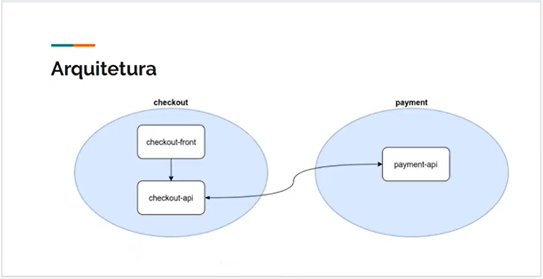

## Digital Innovation One

## Bootcamp: Capgemini  Java & Angular

## Módulo: Criando uma solução de e-commerce com microsserviços em Java

## Instrutor: **Daniel Hatanaka**

Neste projeto prático iremos desenvolver uma solução de e-commerce com a arquitetura de microsserviços e aplicar a integração entre eles orientada a eventos com Apache Kafka e garantir a compatibilidade entre da comunicação dos microsserviços com Schema Registry. Para isso, programaremos em Java utilizando a stack do Spring (Spring Boot, Spring Cloud Streams).

###### Links do projeto original

[ecommerce-checkout-api](https://github.com/hatanakadaniel/ecommerce-checkout-api)

[ecommerce-payment-api](https://github.com/hatanakadaniel/ecommerce-payment-api)

[ecommerce-checkout-frontend](https://github.com/hatanakadaniel/ecommerce-checkout-frontend)
